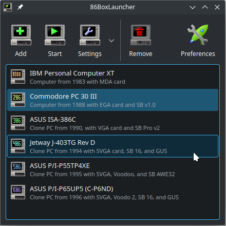

# 86BoxLauncher
The 86BoxLauncher is a configuration manager and launcher for the [86Box][86box] emulator.


 

## Building requirements

* C++17 compiler or newer
* CMake 3.13 or newer
* Qt 5 or Qt 6

### Getting started

The fastest way to get started is to install the Qt development environment and open the `CMakeList.txt` file at the project's root into Qt Creator. Compiling and starting the application should work out of the box.

Building from the command line using CMake, you can tell which Qt version to use by providing the path to the QMake executable with the `QT_QMAKE_EXECUTABLE` variable.

Example:

```bash
cd 86boxlauncher-srcdir
cmake -B build -DQT_QMAKE_EXECUTABLE=$(which qmake6)
cmake --build build
cd build/src
./86BoxLauncher
```

## Licensing

86BoxLaunchers is released under the [GNU General Public License, version 2](https://www.gnu.org/licenses/old-licenses/gpl-2.0.html) or later. For more information, see the `COPYING` file at the repository's root.

<!-- Reference links -->

[86box]: https://github.com/86Box/86Box	"Emulator of retro x86-based machines"

