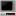
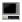
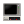
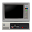
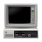
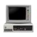
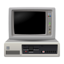
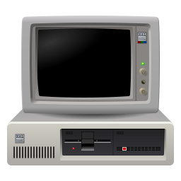

# 86BoxLauncher Icons

This folder contains the source files of icons in the Inkscape format. The program uses optimized versions of these icons.

## Icons

| Filenames     | Sizes                            | Use                       |
| ------------- | -------------------------------- | ------------------------- |
| pc-*          | 16, 22, 24, 32, 48, 64, 128, 256 | Template for other icons  |
| app-*         | 16, 22, 24, 32, 48, 64, 128, 256 | Application icon          |
| vm-new-*      | 48                               | New virtual machine       |
| vm-settings-* | 48                               | Virtual machine settings  |
| vm-remove-*   | 48                               | Remove virtual machine    |
| vm-start-*    | 48                               | Start virtual machine     |
| configure     | 48                               | Configure the application |

## Margins

| Icon size [px] | Margin size [px] |
| -------------- | ---------------- |
| 16x16          | 0                |
| 22x22          | 2                |
| 24x24          | 3                |
| 32x32          | 2                |
| 48x48          | 4                |
| 64x64          | 6                |
| 128x128        | 8                |
| 256x256        | 10               |

## Licensing

86BoxLauncher icons are released under the  [CC0 1.0](http://creativecommons.org/publicdomain/zero/1.0?ref=chooser-v1) 🅭🄍. For more information, see the `COPYING` file.
