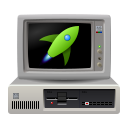

# 86BoxLauncher Icons

This folder contains the source files of icons in the Inkscape format. The program uses optimized versions of these icons.

## Icons

<table>
    <tr>
        <th>Name</th>
        <th>16x16</th>
        <th>22x22</th>
        <th>24x24</th>
        <th>32x32</th>
        <th>48x48</th>
        <th>64x64</th>
        <th>128x128</th>
        <th>256x256</th>
    </tr>
    <tr>
        <td>pc</td>
        <td></td>
        <td></td>
        <td></td>
        <td></td>
        <td></td>
        <td></td>
        <td></td>
        <td></td>
    </tr>
    <tr>
        <td>app</td>
        <td></td>
        <td></td>
        <td></td>
        <td></td>
        <td></td>
        <td></td>
        <td></td>
        <td></td>
    </tr>
        <tr>
        <td>86box-new</td>
        <td></td>
        <td></td>
        <td></td>
        <td></td>
        <td></td>
        <td></td>
        <td></td>
        <td></td>
    </tr>
        </tr>
        <tr>
        <td>86box-settings</td>
        <td></td>
        <td></td>
        <td></td>
        <td></td>
        <td></td>
        <td></td>
        <td></td>
        <td></td>
    </tr>
    </tr>
        <tr>
        <td>86box-remove</td>
        <td></td>
        <td></td>
        <td></td>
        <td></td>
        <td></td>
        <td></td>
        <td></td>
        <td></td>
    </tr>
    </tr>
        <tr>
        <td>86box-start</td>
        <td></td>
        <td></td>
        <td></td>
        <td></td>
        <td></td>
        <td></td>
        <td></td>
        <td></td>
    </tr>
</table>

The pc icon is template for other icons.

## Licensing

86BoxLauncher icons are released under the  [CC0 1.0](http://creativecommons.org/publicdomain/zero/1.0?ref=chooser-v1) 🅭🄍. For more information, see the `COPYING` file.
