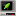

# 86BoxLauncher Icons

This folder contains the source files of icons in the Inkscape format. The program uses optimized versions of these icons.

## Icons

### pc-*

Template for other icons

### app-*

Application icon

## Margins

| Icon size [px] | Margin size [px] |
| -------------- | ---------------- |
| 16x16          | 0                |
| 22x22          | 2                |
| 24x24          | 3                |
| 32x32          | 2                |
| 48x48          | 4                |
| 64x64          | 6                |
| 128x128        | 8                |
| 256x256        | 10               |

## Licensing

86BoxLauncher icons are released under the  [CC0 1.0](http://creativecommons.org/publicdomain/zero/1.0?ref=chooser-v1) 🅭🄍. For more information, see the `COPYING` file.
